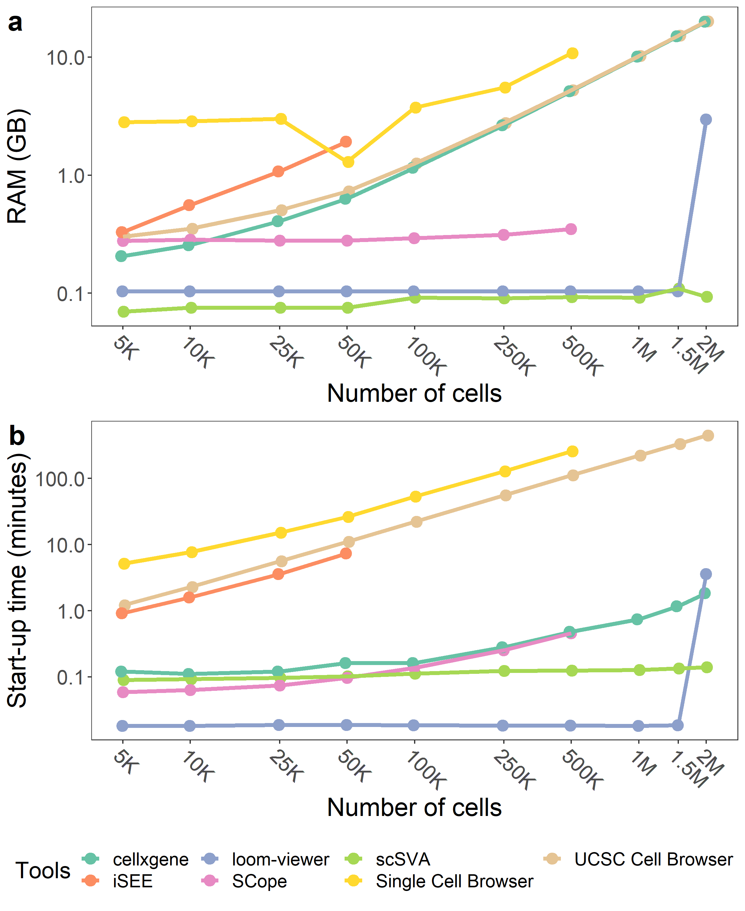

# VisBench-figures
This repository contains the script to create the plots in the paper.
## Required R Libraries
* [cowplot](https://cran.r-project.org/web/packages/cowplot/index.html)
* [tidyverse](https://cran.r-project.org/web/packages/tidyverse/index.html) (includes the packages below and some other useful packages)
    * dplyr
    * stringr
    * tidyr
    * ggplot2

## Fig. 1

