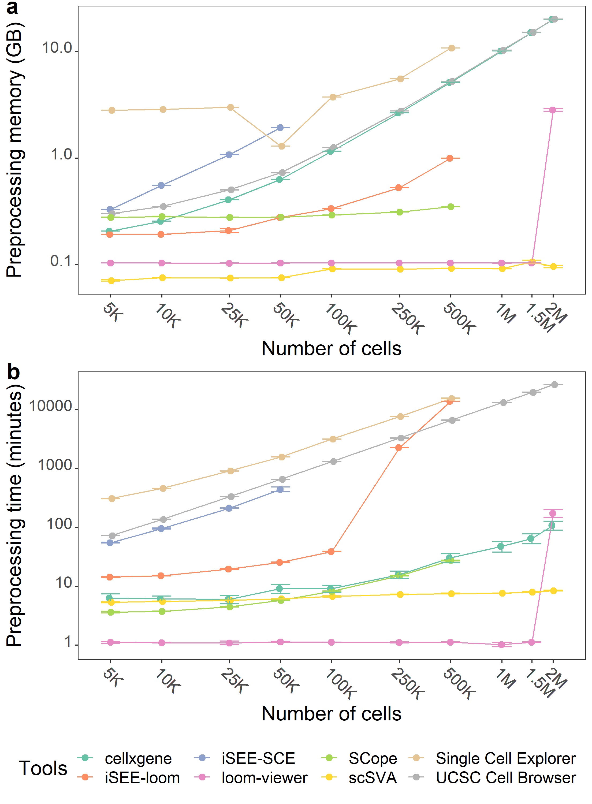

# VisBench-figures
This repository contains the script to create Figure1 in our manuscript entitled ["Comparison of visualisation tools for single-cell RNAseq data"](https://doi.org/10.1101/2020.01.24.918342).
## Required R Libraries
* [cowplot](https://cran.r-project.org/web/packages/cowplot/index.html)
* [tidyverse](https://cran.r-project.org/web/packages/tidyverse/index.html) (includes the packages below and some other useful packages)
    * dplyr
    * stringr
    * tidyr
    * ggplot2

## Fig. 1
